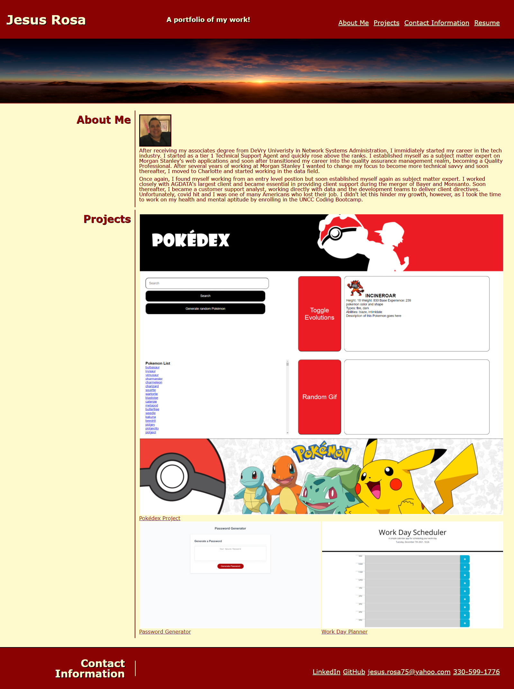

# jesus-rosa-portfolio

## Table of Contents
1. [Description](#description)
2. [Visuals](#visuals)
3. [Links](#links)
4. [Usage](#usage)

### Description  
In this project, we were tasked with:  

- Updating our portfolio to include our first project and two exemplary homework assignments
- Updating our GitHub profile with pinned repositories 
- Updating our resume
- And updating our LinkedIn profile

After completing these initial tasks. I worked on hitting all the points outlined in the grading criteria.   

I made sure all the links functioned properly. As well as, included outside links to my resume, GitHub, and LinkedIn profiles. 

I deployed the site to a live URL and submitted that link along with my GitHub URL. I also ensured there were no load errors and made sure my GitHub repository contained the application code. As well as, updated my profile per the assignments specifications.

Lastly, I updated the repository with a unique name, ensuring it followed best practices for file structure and naming conventions, as well as, following best practices for class/id naming conventions, indentation, and quality comments. I made sure the repository contained multiple descriptive commit messages and a quality README file with a description, screenshot, and a link to the deployed application. 

### Visuals

  

### Links

[Link to application](https://bigzeus2005.github.io/jesus-rosa-portfolio/)  
[Link to GitHub](https://github.com/bigzeus2005/jesus-rosa-portfolio)

### Usage

This project was used to help us apply what we learned to a responsive portfolio that we can showcase to employers. 